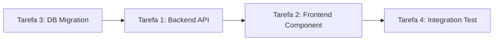

# Skill: tradutor-tiers

## Objetivo

Traduzir o "Desejo Humano" (emocional/narrativo) em "Contratos de Execução" (técnicos/rígidos). Esta skill é a ponte entre o `manifesto_de_intencao.md` (criado pelo Agente de Intenção) e as instruções que os desenvolvedores (Tier 3) recebem.

## Quando Ativar

- Após o Planejador criar o plano de ação
- Antes de delegar tarefas para Arquitetos (Tier 2) e Desenvolvedores (Tier 3)
- Em correção de bugs, ao traduzir a RCA em tarefas de correção

## O Problema Que Resolve

O desenvolvedor (Tier 3) não deve se preocupar com:
- Objetivos emocionais do usuário
- Contexto narrativo do projeto
- "O que o usuário quis dizer com..."

O desenvolvedor deve receber apenas:
- O que precisa ser feito (task)
- Como deve ser feito (tech_spec)
- Como validar que está pronto (acceptance_criteria)

Esta skill garante essa separação. O "humano" entra no início (manifesto), a "máquina" termina o serviço sem precisar olhar para trás.

## Entradas Necessárias

1. **`manifesto_de_intencao.md`** — A narrativa e objetivos emocionais
2. **Plano de ação do Planejador** — As tarefas decompostas
3. **Documentação de arquitetura** — `/docs/architecture/` (se existir)

## Processo de Tradução

### Fase 1: Extração Emocional
1. Ler o `manifesto_de_intencao.md`
2. Identificar os 3 pilares técnicos derivados (Frontend, Backend, Banco)
3. Preservar o sentimento central e os anti-objetivos
4. **NÃO passar a narrativa emotional para o Tier 3** — Ela fica no manifesto

### Fase 2: Decomposição Técnica
Para cada tarefa do plano, extrair:
- **Componentes afetados** — Quais arquivos/módulos
- **Hard Rules** — O que NÃO pode ser alterado
- **Acceptance Criteria** — O que deve ser entregue (critérios mensuráveis)
- **Contratos** — APIs, schemas, interfaces que devem ser respeitados

### Fase 3: Formalização Visual
Gerar um diagrama Mermaid mostrando dependências entre tarefas:



### Fase 4: Contrato de Execução (JSON)

Gerar um contrato estrito para cada tarefa, no formato:

```json
{
  "task_id": "T01",
  "title": "[nome curto]",
  "tier": 3,
  "area": "[frontend | backend | banco-de-dados | devops | documentacao]",
  "manifesto_ref": "/docs/management/manifesto_de_intencao.md",
  "task": "[descrição objetiva do que fazer — sem narrativa]",
  "tech_spec": {
    "files_to_modify": ["caminho/arquivo.ext"],
    "files_to_create": ["caminho/novo-arquivo.ext"],
    "pattern_to_follow": "[padrão/arquitetura de referência]",
    "dependencies": ["T00 (deve terminar primeiro)"]
  },
  "hard_rules": [
    "NÃO alterar [componente X]",
    "NÃO remover [função Y]",
    "SEMPRE usar [padrão Z]"
  ],
  "acceptance_criteria": [
    "[Critério mensurável 1]",
    "[Critério mensurável 2]",
    "[Critério mensurável 3]"
  ],
  "contracts_to_respect": {
    "api": "[endpoint/formato se aplicável]",
    "schema": "[modelo de dados se aplicável]",
    "component": "[props/eventos se aplicável]"
  }
}
```

### Fase 5: Checklist de Implementação

Gerar uma tabela checklist para o desenvolvedor:

```markdown
## Checklist de Implementação — Tarefa T01

- [ ] Li o contrato de execução completo
- [ ] Identifiquei os arquivos a modificar/criar
- [ ] Compreendi as hard rules (não violar)
- [ ] Sei os critérios de aceitação (preciso cumprir todos)
- [ ] Executei a skill `sync-context` ao concluir
```

## Regras de Tradução

- **SEMPRE referencie o manifesto** — Mas não passe a narrativa para o Tier 3
- **NUNCA simplifique o objetivo técnico** — Apenas a instrução de trabalho
- **SEMPRE defina acceptance_criteria mensuráveis** — Não subjetivos
- **SEMPRE liste hard_rules** — O que o dev não pode tocar
- **NUNCA deixe ambiguidade** — Se houver dúvida, o contrato está incompleto
- **Se o Tier 3 receber texto narrativo** — Ele deve retornar: "Especificação técnica incompleta"
- **SEMPRE ative skill `sync-context`** ao concluir a tradução

## Fluxo Completo

```
Agente de Intenção
  → Cria manifesto_de_intencao.md (narrativo, emocional)
  
Planejador Primário
  → Lê manifesto
  → Cria plano de ação (tarefas decompostas)
  
Skill: tradutor-tiers
  → Lê manifesto + plano
  → Gera contratos JSON para cada tarefa
  → Gera diagrama de dependências (Mermaid)
  → Gera checklists de implementação
  
Arquiteto-Geral
  → Recebe contratos
  → Valida e distribui para Tier 2
  
Tier 2 → Tier 3
  → Recebem apenas o contrato JSON + checklist
  → Implementam sem precisar do contexto narrativo
  
Skill: equipe-revisao
  → Compara implementação com contrato + manifesto
  → Valida fidelidade
```

## Saída

A skill gera:
1. `/docs/management/contratos/T01.json` — Contrato da tarefa 01
2. `/docs/management/contratos/T02.json` — Contrato da tarefa 02
3. `/docs/management/contratos/dependencias.md` — Diagrama Mermaid de dependências
4. Atualização de `/docs/management/tarefas.md` — Tarefas com referência aos contratos
