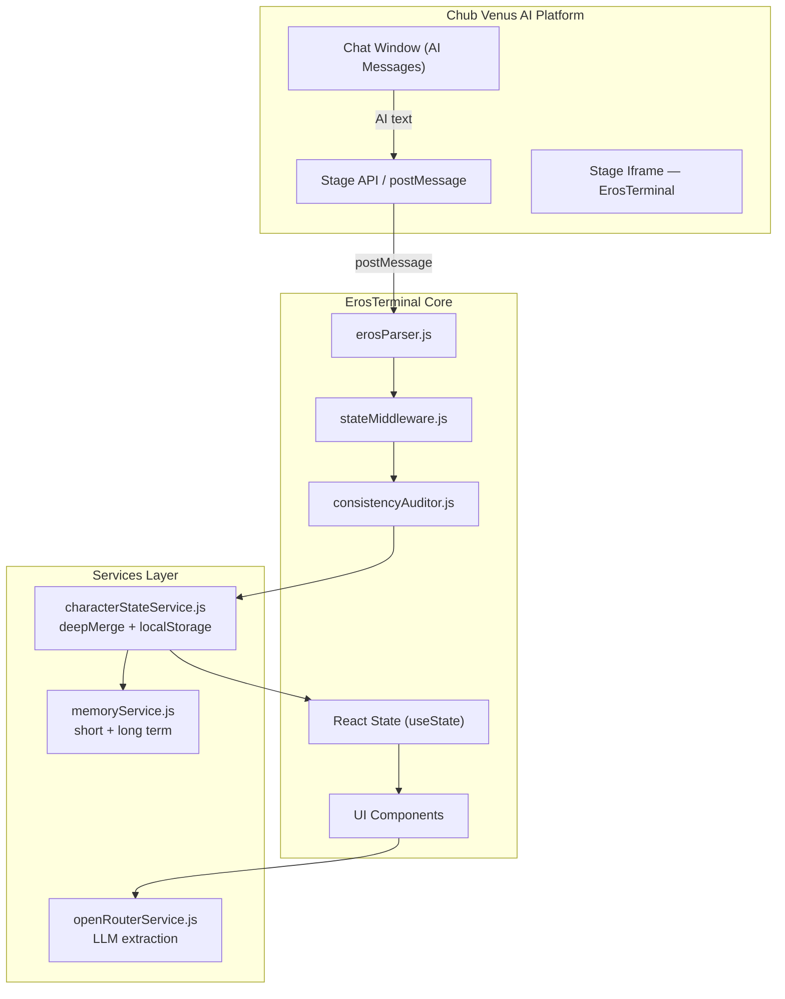
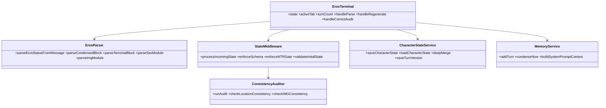
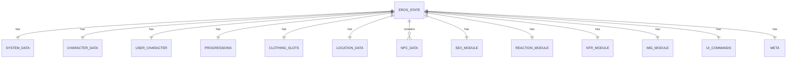
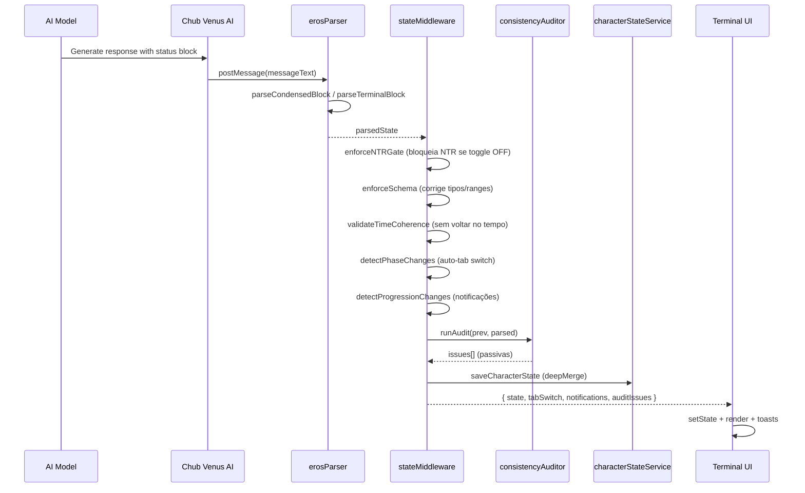
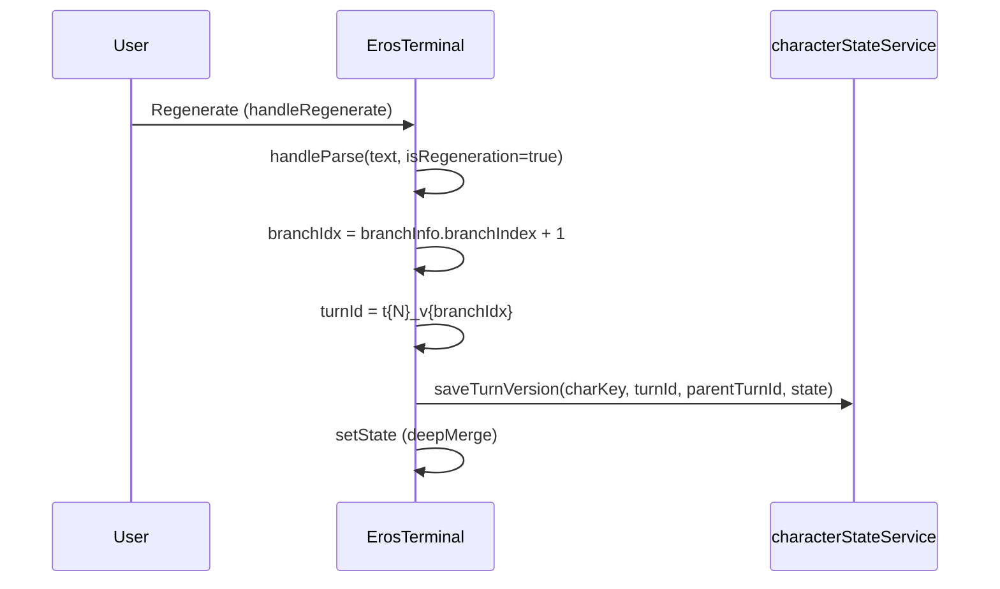
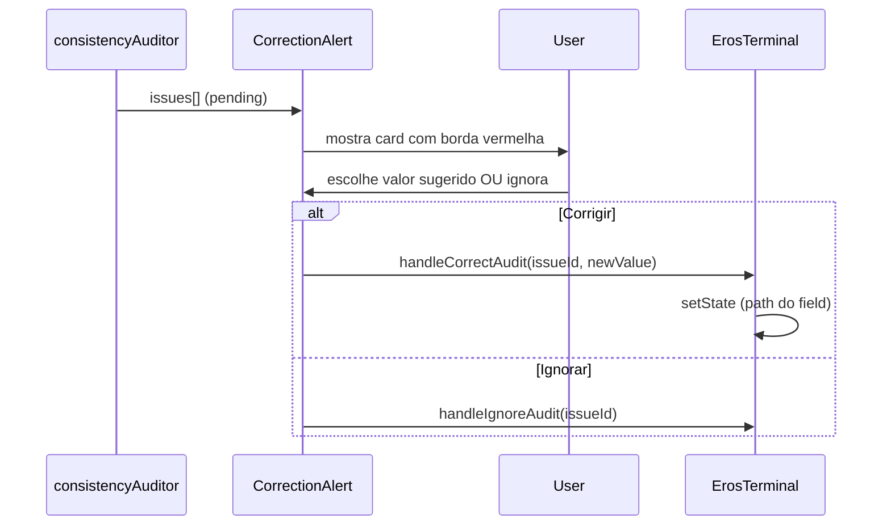
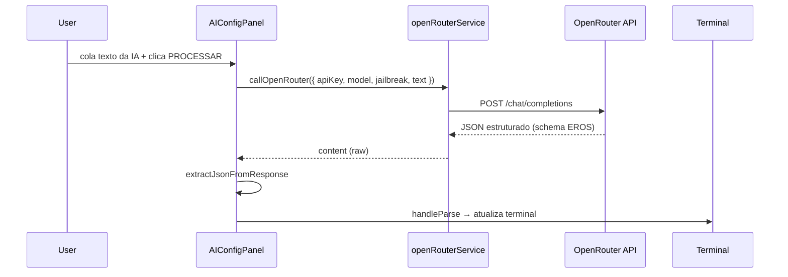

# 01 — Arquitetura, SRS, Fluxos e Contrato de Dados

> Parte 1/10 da documentação completa do Eros Status Terminal. Ver `COMPLETO.md` para o índice mestre.

---

## 1. Objetivo

O **Eros Status Terminal (ESS)** é um painel visual cyberpunk embarcado como *Stage iframe* na plataforma **Chub Venus AI**. Ele recebe a saída de texto da IA em tempo real, faz o *parse* dos marcadores de status do roleplay e renderiza — fora da janela de chat — progressões (afeto, libido, excitação), estado emocional, pensamentos, roupas, inventário, localização com mini-mapa, avatar com expressão, metas, NPCs, módulos de sexo/reação/NTR e prompts de geração de imagem (ComfyUI/Civitai).

### Problema resolvido
Blocos de status inline no texto narrativo poluem a leitura e consomem tokens. O Stage resolve isso extraindo esses dados para um painel dedicado, mantendo a narrativa limpa.

### Evolução arquitetural (v3.0)
- **Parser framework-agnostic** (`erosParser.js`) — JavaScript puro, sem dependências.
- **Middleware híbrido** (`stateMiddleware.js`) — atua como "juiz" entre a IA e a UI: valida coerência temporal/espacial, faz *auto-trigger* de abas, valida `ui_commands`, detecta mudanças de progressão e gera notificações.
- **Persistência entre turnos** (`characterStateService.js`) — *deep-merge* em `localStorage` garante que dados do personagem sobrevivam a resets de prompt do Chub.
- **Memória híbrida de longo prazo** (`memoryService.js`) — janela de curto prazo (20 turnos) + longo prazo condensado (fatos + diário narrativo).
- **Auditor de consistência passivo** (`consistencyAuditor.js`) — detecta 7 categorias de inconsistência e expõe correção manual via `CorrectionAlert`/`AuditPanel`.
- **Contrato ComfyUI/Civitai** (`IMGPanel`) — *anchors* físicos fixos + *scene prompts* dinâmicos, com auditoria de mismatch.
- **Sistema de relacionamentos** (`relationshipSystem.js`) — dois eixos (Family Tier + Affection Tier) que *gating* estatísticas por cenário.
- **Branching de turnos** — suporte a regenerações de resposta da IA sem perder estado anterior.
- **OpenRouter integration** — extração de status via LLM com seletor de modelo *autocomplete* ao vivo.

### Deploy standalone (Chub Venus AI)
O projeto roda em desenvolvimento sobre o Base44 (roteador React, auth, build), mas o núcleo `ErosTerminal` é **100% client-side** e pode ser deployado como iframe standalone removendo `react-router-dom`, `@tanstack/react-query` e `@base44/sdk`. Comentários `MIGRAÇÃO` em cada arquivo documentam as remoções necessárias.

---

## 2. Tecnologias

| Categoria | Tecnologia |
|-----------|-----------|
| Framework UI | React 18.2 |
| Build | Vite 6.1 |
| Estilo | Tailwind CSS 3.4 + CSS Variables (tema cyberpunk) |
| Tipografia | JetBrains Mono / Share Tech Mono |
| Animações | Framer Motion 11.16 |
| Ícones | lucide-react 0.475 |
| Roteamento (dev) | react-router-dom 6.26 |
| Data fetching (dev) | @tanstack/react-query 5.84 |
| Plataforma dev | Base44 (BaaS: auth, build, hosting) |
| UI primitives | shadcn/ui (new-york style) + Radix UI |
| Persistência | `localStorage` (sem backend) |
| IA | OpenRouter API (fetch nativo) |
| Outros | date-fns, lodash, recharts, zod, react-leaflet, three.js |

---

## 3. Estrutura de Pastas

```text
eros-status-stage/
├── COMPLETO.md                  ← índice mestre
├── docs/                        ← documentação completa (10 arquivos)
├── README.md
├── package.json · vite.config.js · tailwind.config.js
├── postcss.config.js · jsconfig.json · components.json
├── eslint.config.js · .gitignore · index.html
├── base44/config.jsonc
└── src/
    ├── main.jsx · App.jsx · index.css
    ├── api/base44Client.js
    ├── hooks/use-mobile.jsx
    ├── utils/index.ts
    ├── lib/
    │   ├── utils.js · app-params.js · query-client.js
    │   ├── AuthContext.jsx · PageNotFound.jsx
    │   ├── erosParser.js · stateMiddleware.js
    │   ├── memoryService.js · consistencyAuditor.js
    │   ├── relationshipSystem.js · sexPositionsLibrary.js
    ├── services/
    │   ├── openRouterService.js · characterStateService.js
    ├── pages/
    │   ├── Terminal.jsx · Demo.jsx · SRS.jsx
    └── components/
        ├── ProtectedRoute.jsx · UserNotRegisteredError.jsx
        ├── terminal/ (27 componentes)
        └── ui/ (shadcn/ui — 49 componentes padrão)
```

---

## 4. Arquitetura

### 4.1 Visão de Alto Nível



### 4.2 Pipeline de Processamento de Estado

```mermaid
flowchart LR
    A["AI Output Text"] --> B["parseErosStatusFromMessage"]
    B --> D["enforceNTRGate"] --> E["enforceSchema"]
    E --> F["validateTimeCoherence"] --> G["validateLocationCoherence"]
    G --> H["detectPhaseChanges"] --> I["detectProgressionChanges"]
    I --> J["validateUICommands"] --> K["runAudit"]
    K --> L["saveCharacterState"] --> M["setState + UI render"]
```



### 4.3 Diagrama de Classes (UML)



### 4.4 ERD — Modelo de Dados do Estado



---

## 5. SRS DOCS & Interface Prototype

A documentação SRS completa é renderizada in-app na rota `/srs` (`src/pages/SRS.jsx`), contendo 16 seções: Overview, Proposal, Scope, Requirements, Relationship System, Body Description, IMG Module, Architecture, Wireframes, UML, ERD, Sequence Diagrams, Component Diagrams, Tools, Interface Prototype e Changelog. O código-fonte completo de `SRS.jsx` está em `docs/03-PAGES.md`.

### Interface Prototype


### Wireframe (layout 320px)

```text
┌──────────────────────────────────┐  ← 320px wide
│   EROS  STATUS  TERMINAL         │
│ ┌──────────────────────────────┐ │
│ │ Day 5 │ 14:32 │ ☀️ │ 📍 Bed │ │
│ └──────────────────────────────┘ │
│ ┌──────────────────────────────┐ │
│ │ [matrix bg]  Hanako [MILF]   │ │
│ │ 😳  MOOD: Flustered          │ │
│ └──────────────────────────────┘ │
│ [STATUS][INV][CHAR][MAP][NPCs]    │
│   [SEX][REACT][NTR][IMG][RAW]     │
│   [AUDIT][CONFIG][AI]             │
├──────────────────────────────────┤
│  ── STATUS TAB ──                │
│ ┌──────────────────────────────┐ │
│ │ PROGRESSIONS                 │ │
│ │ 💕 Affection  75% [████░░]   │ │
│ │ 🎯 Obedience  80% [████░░]   │ │
│ │ 🔥 Libido     55% [███░░░]   │ │
│ │ 🍑 Arousal    70% [████░░]   │ │
│ └──────────────────────────────┘ │
│ ┌──────────────────────────────┐ │
│ │ 🤝 RELATIONSHIPS             │ │
│ │ Hanako → User                │ │
│ │ [MILF] [Spouse] ✓Rom ✓Erot   │ │
│ └──────────────────────────────┘ │
├──────────────────────────────────┤
│ ▸ [paste AI output...] [PARSE]   │
│ T#5  v1  ⚠0  🔍0  • ESS v3.0     │
│ [NTR]                    ● LIVE  │
└──────────────────────────────────┘
```

### Princípios UI/UX aplicados
- **Hierarquia de informação** — estatísticas mais usadas primeiro; header CRT ancora o contexto.
- **Contraste neon** — fundo `#0A0A0A` com acentos neon para legibilidade no escuro.
- **Tipografia monoespaçada** — JetBrains Mono cria sensação autêntica de terminal.
- **Disclosure progressivo** — sistema de abas esconde info não essencial.
- **Feedback ao vivo** — barras coloridas mudam dinamicamente; emoji de expressão atualiza.
- **Estética CRT** — overlay de scanlines, animações de glitch, cursor piscante.
- **Degradação graciosa** — fallbacks de emoji, estados "No NPCs detected".

---

## 6. Fluxos (Sequence Diagrams)

### 6.1 Fluxo de Parse de Mensagem



### 6.2 Fluxo de Regeneração (Branching)



### 6.3 Fluxo de Correção de Auditoria



### 6.4 Fluxo de Extração via OpenRouter



---

## 7. Entidades e Contratos (JSON Schema)

O estado do terminal segue um contrato JSON estrito (embutido como comentário HTML no `AIConfigPanel.jsx` para guiar a IA). Versão resumida:

```json
{
  "type": "object",
  "properties": {
    "system": { "type": "object", "properties": { "day": {"type":"integer"}, "time": {"type":"string"}, "weather": {"type":"string"}, "sceneType": {"type":"string","enum":["daily_life","flirting","sex","post-sex","conflict","travel","rest"]} }, "additionalProperties": false },
    "character": { "type": "object", "properties": { "name": {"type":"string"}, "role": {"type":"string"}, "mood": {"type":"string"}, "expression": {"type":"string"}, "thoughts": {"type":"string"}, "relationship": {"type":"string"} }, "additionalProperties": false },
    "userCharacter": { "type": "object", "properties": { "name": {"type":"string"}, "relation": {"type":"string"}, "mood": {"type":"string"}, "relationships": {"type":"array"} }, "additionalProperties": false },
    "progressions": { "type": "object", "properties": { "affection":{"type":"integer","minimum":0,"maximum":100}, "obedience":{"type":"integer","minimum":0,"maximum":100}, "libido":{"type":"integer","minimum":0,"maximum":100}, "arousal":{"type":"integer","minimum":0,"maximum":100}, "trust":{"type":"integer"}, "corruption":{"type":"integer"}, "happiness":{"type":"integer"}, "embarrassment":{"type":"integer"}, "fatigue":{"type":"integer"}, "love":{"type":"integer"}, "jealousy":{"type":"integer"}, "anxiety":{"type":"integer"}, "fear":{"type":"integer"}, "anger":{"type":"integer"}, "nervousness":{"type":"integer"}, "tension":{"type":"integer"}, "shame":{"type":"integer"}, "desire":{"type":"integer"}, "awe":{"type":"integer"}, "guilt":{"type":"integer"}, "excitement":{"type":"integer"}, "sadness":{"type":"integer"}, "submission":{"type":"integer"}, "health":{"type":"integer"} }, "additionalProperties": false },
    "clothingSlots": { "type": "object", "properties": { "head":{"type":"string"}, "upper":{"type":"string"}, "lower":{"type":"string"}, "underwear":{"type":"string"}, "footwear":{"type":"string"}, "accessories":{"type":"string"} }, "additionalProperties": false },
    "body": { "type": "object", "properties": { "expression":{"type":"string"}, "posture":{"type":"string"}, "thoughts":{"type":"string"}, "shamefulThought":{"type":"string"}, "description": { "type":"object","properties":{"hair":{"type":"string"},"eyes":{"type":"string"},"face":{"type":"string"},"chest":{"type":"string"},"bust":{"type":"string"},"waist":{"type":"string"},"hips":{"type":"string"},"legs":{"type":"string"},"tail":{"type":"string"},"horns":{"type":"string"},"special":{"type":"string"}} } }, "additionalProperties": false },
    "location": { "type": "object", "properties": { "currentRoom":{"type":"string"}, "building":{"type":"string"}, "description":{"type":"string"}, "visitedRooms":{"type":"array"}, "knownRooms":{"type":"array"}, "objectsInRoom":{"type":"array"}, "miniMapData":{"type":"array"} }, "additionalProperties": false },
    "inventory": { "type": "object", "properties": { "items":{"type":"array"} }, "additionalProperties": false },
    "goals": { "type": "array", "items": {"type":"string"} },
    "npcs": { "type": "array", "items": { "type": "object", "properties": { "name":{"type":"string"}, "relation":{"type":"string"}, "mood":{"type":"string"}, "importance":{"type":"string"}, "relationships":{"type":"array"} }, "required":["name"] } },
    "sexModule": { "type": "object", "properties": { "active":{"type":"boolean"}, "phase":{"type":"string","enum":["none","flirting","sex","post-sex"]}, "position":{"type":"string"}, "pace":{"type":"string"}, "orgasmCount":{"type":"integer"}, "sensory_metrics":{"type":"object"}, "senses":{"type":"object"}, "male":{"type":"object"}, "female":{"type":"object","properties":{"menstrualCycle":{"type":"object"}}}, "stimulusDescription":{"type":"string"} } },
    "reactionModule": { "type": "object", "properties": { "active":{"type":"boolean"}, "character":{"type":"string"}, "stimulus":{"type":"string"}, "reactions":{"type":"array"} } },
    "ntrModule": { "type": "object", "properties": { "enabled":{"type":"boolean"}, "active":{"type":"boolean"}, "ntrCharacter":{"type":"string"}, "ntrPartner":{"type":"string"}, "jealousyLevel":{"type":"integer"}, "betrayalStage":{"type":"string"} } },
    "ui_commands": { "type": "object", "properties": { "suggested_tab":{"type":"string"}, "notification":{"type":"object"}, "map_focus":{"type":"string"}, "map_reveal":{"type":"array"} } },
    "meta": { "type": "object", "properties": { "turn_id":{"type":"string"}, "parent_turn_id":{"type":"string"}, "branch_index":{"type":"integer"}, "validated":{"type":"boolean"}, "coerced_fields":{"type":"array"} } },
    "img_module": { "type": "object", "properties": { "anchors":{"type":"object"}, "scene":{"type":"object","properties":{"positive":{"type":"string"},"negative":{"type":"string"},"camera_suggestions":{"type":"array"}}}, "params":{"type":"object","properties":{"checkpoint":{"type":"string"},"loras":{"type":"array"},"sampler":{"type":"string"},"steps":{"type":"integer"},"cfg":{"type":"number"},"clip_skip":{"type":"integer"},"hires_fix":{"type":"object"},"aspect_ratio":{"type":"string"}}} } }
  },
  "additionalProperties": false
}
```

---

*Próximo: `docs/02-CONFIGS_RAIZ.md` — configurações de raiz e `src/index.css`.*