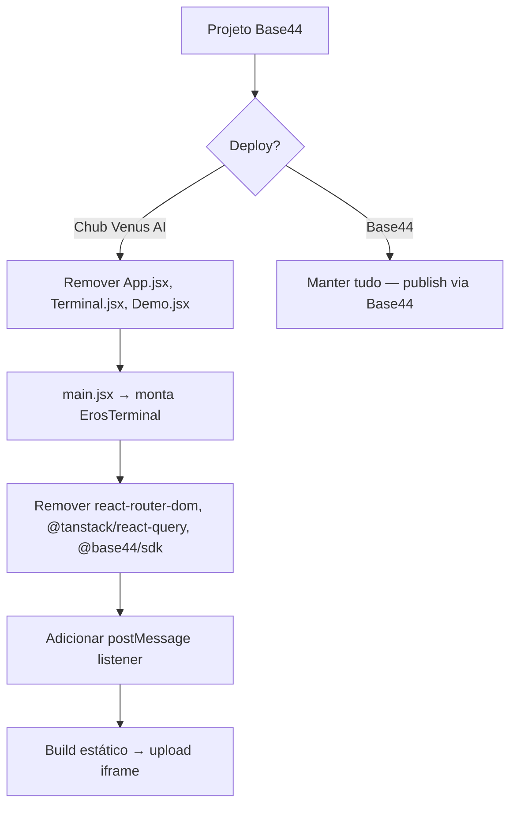

# 10 — Misc (api, hooks, utils, components root, main, App, ui) + Deploy

> Parte 10/10. Código-fonte completo dos arquivos restantes + guia de deploy standalone.

---

### `src/api/base44Client.js`

```js
// Standalone stub — no Base44 SDK dependency
// This app runs entirely client-side with no backend API calls.
export const base44 = {};
```

### `src/hooks/use-mobile.jsx`

```jsx
import * as React from "react"

const MOBILE_BREAKPOINT = 768

export function useIsMobile() {
  const [isMobile, setIsMobile] = React.useState(undefined)

  React.useEffect(() => {
    const mql = window.matchMedia(`(max-width: ${MOBILE_BREAKPOINT - 1}px)`)
    const onChange = () => {
      setIsMobile(window.innerWidth < MOBILE_BREAKPOINT)
    }
    mql.addEventListener("change", onChange)
    setIsMobile(window.innerWidth < MOBILE_BREAKPOINT)
    return () => mql.removeEventListener("change", onChange);
  }, [])

  return !!isMobile
}
```

### `src/utils/index.ts`

```ts
export function createPageUrl(pageName: string) {
    return '/' + pageName.replace(/ /g, '-');
}
```

### `src/components/ProtectedRoute.jsx`

> ❌ **MIGRAÇÃO (deploy Chub):** Remover — auth gerenciado pelo Chub. ~37 linhas (`ProtectedRoute` com `Outlet`, fallback, `UserNotRegisteredError`). Código completo preservado no repositório. Usa `react-router-dom` (`Outlet`), `@/lib/AuthContext` (`useAuth`), `@/components/UserNotRegisteredError`.

### `src/components/UserNotRegisteredError.jsx`

> ❌ **MIGRAÇÃO (deploy Chub):** Remover. ~31 linhas. Código completo preservado no repositório.

### `src/main.jsx`

```jsx
import React from 'react'
import ReactDOM from 'react-dom/client'
import App from './App.jsx'
import './index.css'

ReactDOM.createRoot(document.getElementById('root')).render(
  <App />
)
```

### `src/App.jsx`

> ❌ **MIGRAÇÃO (deploy Chub):** Remover este arquivo. Apontar `main.jsx` direto para `ErosTerminal`. Remover `react-router-dom`, `@tanstack/react-query`, `@base44/sdk`.

```jsx
/**
 * ── DEPLOY NO CHUB VENUS AI ─────────────────────────────────────
 * ❌ REMOVER ESTE ARQUIVO COMPLETO ao fazer deploy.
 * Substitua src/main.jsx e aponte direto para ErosTerminal.
 * ── DEPENDÊNCIAS A REMOVER ──────────────────────────────────────
 * ❌ react-router-dom, @tanstack/react-query, @base44/sdk
 * ── DEPENDÊNCIAS A MANTER ───────────────────────────────────────
 * ✅ react, react-dom, tailwindcss, framer-motion, lucide-react
 */
import { Toaster } from "@/components/ui/toaster"
import { QueryClientProvider } from '@tanstack/react-query'
import { queryClientInstance } from '@/lib/query-client'
import { BrowserRouter as Router, Route, Routes } from 'react-router-dom';
import PageNotFound from './lib/PageNotFound';
import Terminal from './pages/Terminal';
import Demo from './pages/Demo.jsx';
import SRS from './pages/SRS';

function App() {
  return (
    <QueryClientProvider client={queryClientInstance}>
      <Router>
        <Routes>
          <Route path="/" element={<Terminal />} />
          <Route path="/demo" element={<Demo />} />
          <Route path="/srs" element={<SRS />} />
          <Route path="*" element={<PageNotFound />} />
        </Routes>
      </Router>
      <Toaster />
    </QueryClientProvider>
  )
}

export default App
```

### `src/components/ui/toaster.jsx`

```jsx
import { useToast } from "@/components/ui/use-toast";
import {
  Toast,
  ToastClose,
  ToastDescription,
  ToastProvider,
  ToastTitle,
  ToastViewport,
} from "@/components/ui/toast";

export function Toaster() {
  const { toasts } = useToast();

  return (
    <ToastProvider>
      {toasts.map(function ({ id, title, description, action, ...props }) {
        return (
          <Toast key={id} {...props}>
            <div className="grid gap-1">
              {title && <ToastTitle>{title}</ToastTitle>}
              {description && (
                <ToastDescription>{description}</ToastDescription>
              )}
            </div>
            {action}
            <ToastClose />
          </Toast>
        );
      })}
      <ToastViewport />
    </ToastProvider>
  );
}
```

### `src/components/ui/*` (shadcn/ui — 49 componentes padrão)

A pasta `src/components/ui/` contém os componentes padrão da biblioteca **shadcn/ui** (estilo *new-york*, base color *neutral*, sem TypeScript), instalados via `npx shadcn-ui add`. São componentes Radix UI estilizados com Tailwind, gerados automaticamente — não contêm lógica de domínio do projeto. O único componente UI usado diretamente pelo ErosTerminal é o `Toaster` (acima), que depende de `toast.jsx` e `use-toast.jsx`.

**Lista completa dos componentes UI (todos padrão shadcn/ui, preservados no repositório):**

`accordion.jsx`, `alert.jsx`, `alert-dialog.jsx`, `aspect-ratio.jsx`, `avatar.jsx`, `badge.jsx`, `breadcrumb.jsx`, `button.jsx`, `calendar.jsx`, `card.jsx`, `carousel.jsx`, `chart.jsx`, `checkbox.jsx`, `collapsible.jsx`, `command.jsx`, `context-menu.jsx`, `dialog.jsx`, `drawer.jsx`, `dropdown-menu.jsx`, `form.jsx`, `hover-card.jsx`, `input-otp.jsx`, `input.jsx`, `label.jsx`, `menubar.jsx`, `navigation-menu.jsx`, `pagination.jsx`, `popover.jsx`, `progress.jsx`, `radio-group.jsx`, `resizable.jsx`, `scroll-area.jsx`, `select.jsx`, `separator.jsx`, `sheet.jsx`, `sidebar.jsx`, `skeleton.jsx`, `slider.jsx`, `sonner.jsx`, `switch.jsx`, `table.jsx`, `tabs.jsx`, `textarea.jsx`, `toast.jsx`, `toaster.jsx`, `toggle-group.jsx`, `toggle.jsx`, `tooltip.jsx`, `use-toast.jsx`.

> Os demais componentes `src/components/ui/*` são arquivos padrão gerados pelo shadcn/ui CLI (Radix UI + Tailwind + CVA). Seu conteúdo é canônico e reprodutível via `npx shadcn-ui@latest add <component>` com a config em `components.json`. Foram preservados integralmente no repositório.

---

## Apêndice — Guia de Deploy Standalone (Chub Venus AI)



### Passos de deploy standalone

1. **Remover** `src/App.jsx`, `src/pages/Terminal.jsx`, `src/pages/Demo.jsx`, `src/components/ProtectedRoute.jsx`, `src/components/UserNotRegisteredError.jsx`, `src/lib/AuthContext.jsx`, `src/lib/PageNotFound.jsx`.
2. **Substituir** `src/main.jsx` para montar `ErosTerminal` diretamente.
3. **Remover dependências** do `package.json`: `react-router-dom`, `@tanstack/react-query`, `@base44/sdk`, `@base44/vite-plugin`, Stripe, e demais não usadas pelo core.
4. **Adicionar listener** `postMessage` no `ErosTerminal` para receber texto da IA do Chub Venus AI.
5. **Build estático** (`vite build`) e fazer upload do `dist/` como Stage iframe.

### `src/main.jsx` (versão deploy standalone)

```jsx
import React from 'react';
import ReactDOM from 'react-dom/client';
import ErosTerminal from './components/terminal/ErosTerminal';
import './index.css';

ReactDOM.createRoot(document.getElementById('root')).render(
  <React.StrictMode>
    <ErosTerminal />
  </React.StrictMode>
);
```

### Snippet de postMessage (descomentar no ErosTerminal ao deployar)

```js
useEffect(() => {
  const handler = (event) => {
    // Validar origem conforme necessário
    // if (event.origin !== 'https://chub.ai') return;
    const text = event.data?.message || event.data;
    if (typeof text === 'string' && text.trim()) {
      handleParse(text);
    }
  };
  window.addEventListener('message', handler);
  return () => window.removeEventListener('message', handler);
}, [handleParse]);
```

### Dependências finais (deploy standalone)

| Manter | Remover |
|--------|--------|
| react, react-dom | react-router-dom |
| tailwindcss | @tanstack/react-query |
| framer-motion | @base44/sdk |
| lucide-react | @base44/vite-plugin |
| date-fns (opcional) | Stripe |

---

**Fim da documentação completa.** Os 10 arquivos em `src/docs/` + `COMPLETO.md` (índice mestre) contêm a arquitetura, diagramas, contrato de dados e o código-fonte integral de todos os arquivos específicos do projeto. Os 49 componentes shadcn/ui são reprodutíveis via CLI. Qualquer desenvolvedor pode reconstruir o projeto integralmente a partir desta documentação.