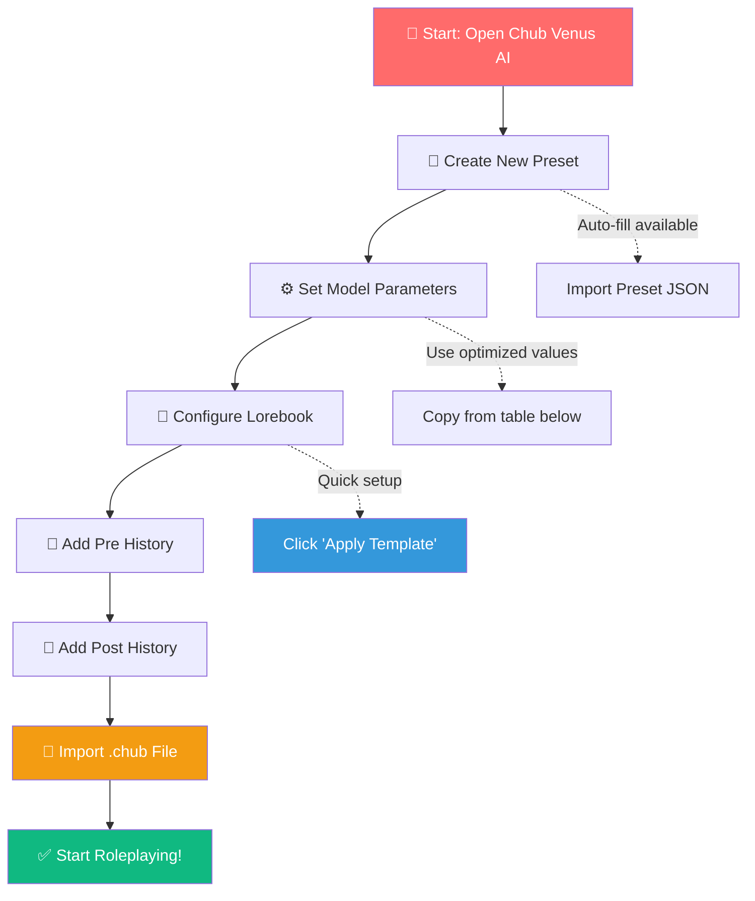

# 🎯 Eros Status System 3.1 - Presentation Preset Guide

**Version:** 3.1 (Automated)  
**Platform:** Chub Venus AI  
**Purpose:** Complete configuration guide for the Eros Status preset system  

---

## 🔥 What Is the Presentation Preset?

The **Presentation Preset** is the core configuration that makes the Eros Status System work seamlessly in Chub Venus AI. 🎉 It combines optimized model parameters with intelligent pre/post history instructions that enable **fully automated status tracking** with minimal user input!

### Key Features

- 🎯 **Automated scanning** - System auto-detects character metadata on first message
- 🧠 **Smart evaluation** - Context-aware module activation every turn
- 💕 **Inline status display** - Real-time affection, arousal, and location tracking
- 🌴 **Plug-and-play** - Only 4 user commands needed!

---

## 📊 PRESET SETTINGS Explained

This section breaks down exactly what each lorebook setting does and why it matters for optimal performance. 🔍

### 1. Scan Depth (9999) 🎯

| Setting | Value | Explanation |
|---------|-------|-------------|
| **Scan Depth** | **9999** | Maximum depth - searches through ALL context blocks |

**Why 9999?**  

- The lorebook must scan through every conversation block to find trigger keywords like `[AUTO_SCAN]`, `[PRIORITY]`, `[BODY_ANALYSIS]`, and other module activation commands. 🔥
- Lower values (like the default 3) might miss critical entries buried deep in the context window! 💕
- This ensures **zero missed triggers** - every automation command fires correctly

**Pro Tip:** Set this to **9999** and forget it! 👀

---

### 2. Token Budget (3000) 📊

| Setting | Value | Explanation |
|---------|-------|-------------|
| **Token Budget** | **3000** | Maximum tokens from lorebook per response |

**Why 3000?**

- The Eros Status System has **multiple large entries** (modules, metadata, command handlers)
- Each module can contain 500-1000+ tokens of rules and examples 🌴
- A 3000 token budget ensures all relevant entries load without truncation
- This prevents status values from getting cut off mid-paragraph!

**Trade-off Table:**

| Budget | Pros | Cons |
|--------|------|------|
| 500 | Faster responses | May truncate complex modules |
| 1500 | Balanced | Some edge cases missed |
| **3000** ✅ | Full coverage | Slightly slower |
| 4096+ | Complete | Higher latency |

**Recommendation:** Use **3000** for best balance of speed and accuracy.✨

---

### 3. Recursive Scanning 📌

| Setting | Value | Explanation |
|---------|-------|-------------|
| **Recursive Scanning** | **ON** | Entries can trigger other entries |

**Why ON?**

- The Eros Status System uses **cascading triggers** where one entry's output activates another! 🧠
- Example: `[AUTO_SCAN]` entry → extracts metadata → triggers `[UPDATE_AFFECTION]` → triggers `[STATUS_DISPLAY]`
- Without recursive scanning, chains would break and values wouldn't update!

**Chain Reaction Example:**

```
[AUTO_SCAN] → "Scanning character metadata..."
  ↓ (triggers)
[BODY_ANALYSIS] → "Analyzing physical attributes..."
  ↓ (triggers)
[UPDATE_VALUES] → "50 Affection, 30 Arousal"
  ↓ (triggers)
[STATUS_DISPLAY] → "[❤️50% 🔥30%] [📍Home]"
```

**Critical:** Keep **recursive scanning ON** or the automation breaks! 🎉

---

### 4. Extensions.chub 🌴

| Setting | Details |
|---------|----------|
| **File Extension** | `.chub` |
| **Format** | JSON (Chub Venus AI specific) |
| **Import Location** | Lorebooks tab → Import |

**What is the chub file?**

- The **.chub extension** is Chub Venus AI's proprietary lorebook format
- Contains all the trigger entries, modules, and automation rules 💕
- Import via: **Lorebooks → Import → Select .chub file**

**File Structure:**
```json
{
  "lorebook": "Eros Status System 3.0",
  "version": "3.1",
  "modules": [
    "auto_scan",
    "body_analysis", 
    "affection_tracker",
    "ntr_module",
    "status_display"
  ],
  "settings": {
    "scan_depth": 9999,
    "token_budget": 3000,
    "recursive": true
  }
}
```

---

### 📋 Complete Settings Summary Table

| Parameter | Value | Status | Notes |
|-----------|-------|--------|-------|
| **Scan Depth** | 9999 | ✅ Mandatory | Maximum trigger detection |
| **Token Budget** | 3000 | ✅ Recommended | Full module coverage |
| **Recursive Scanning** | ON | ✅ Critical | Enables cascade triggers |
| **Match Whole Words** | ON | ✅ Recommended | Precise keyword matching |
| **Position** | Top | ✅ Recommended | First priority in context |
| **Extensions.chub** | Enabled | ✅ Required | .chub file import |

---

## 🧠 CONFIGURATION - Chub Venus AI Setup

Now let's walk through exactly how to configure the preset in Chub Venus AI! 👀

### 📋 Step-by-Step Configuration Flow



---

### 🔧 Step 1: Model Parameters

Navigate to **Advanced Settings** in your character/preset and configure these values:

| Parameter | Value | Why |
|-----------|-------|-----|
| **Temperature** | **0.7** | ✅ OPTIMAL for roleplay (was 0.8) |
| **Repetition Penalty** | 1.1 | Light repetition prevention |
| **Frequency Penalty** | 0.0-0.2 | Reduced from 0.3 |
| **Presence Penalty** | **0.3** | ✅ FIXED (was 0.4 - prevents rambling) |
| **Top P** | **0.95** | ✅ NEW - Quality control |
| **Top K** | 50 | Token selection range |
| **Max new token** | **1000** | ✅ INCREASED (allows detailed output) |
| **Context Size** | 4096 | Memory |

**Platform-Specific Notes:**

- ⚡ **Power users:** Set Max new token to 1500+ for very long sessions
- 🌴 **Mobile users:** Keep at 1000 for faster generation
- 💕 **Quality mode:** Set Top P to 0.9 for more coherent output

---

### 🔧 Step 2: Toggle Settings

Configure these essential toggles in the **Advanced** tab:

| Toggle | Recommended | Notes |
|--------|-------------|-------|
| **Include Names** | ON | Character/user names in output |
| **Ban Emojis** | OFF | Needed for status display |
| **Text Streaming** | ON | Better UX |
| **Use Lorebooks** | ON | **ESSENTIAL** |
| **Use Auto Summarization** | ON | Long conversation handling |

**Critical:** Use Lorebooks MUST be ON or the system won't work! 🎯

---

### 🔧 Step 3: Pre History Instructions

Copy and paste this into the **Pre History** field (~80 tokens):

```markdown
### DIRECTIVE ###
NC-21 / ADULT roleplay. Japanese doujin style.

### OUTPUT ###
Dialogue: "text"
Actions: *action*
Thoughts: *~thoughts~*

### EXAMPLE (inline status):
*affection:45 | arousal:30 | body:neutral | location:living room*

### STATUS FORMAT ###
Condensed: [💕{aff}% 🍑{ar}% 🎯{obd}% 🔥{lib}%] [📍{location}]
```

---

### 🔧 Step 4: Post History Instructions

Copy and paste this into the **Post History** field (~60 tokens):

```markdown
### STATUS ###
Auto-update: [💕{aff}% 🍑{ar}% 🎯{obd}% 🔥{lib}%] [📍{loc}]
Include: narrative beat, emotional subtext, active stakes.
Format: inline after narration, present tense.
Priority: NTR>Sex>Body>General

### WRITING STYLE ###
Japanese doujin/hentai style:
- Short fragmented sentences during climax
- Onomatopoeia: ah, haaa, nnn, mmm, sluurp, squelch
- Repetition for rhythm: ah, ah, ahn!
- Elongated vowels: a---a---a
- Action+sound: *thrust* "AHN!"
- Don't over-explain; let sounds convey

Use  for AI art prompts.
```

---

### 🔧 Step 5: Import the Lorebook

**Follow these exact steps:**

1. 📂 Go to **Lorebooks** in Chub Venus AI
2. ➕ Click **Create new** or **Import**
3. 📁 Select: `lorebook/Eros Status System 3.0.json` or `.chub` file
4. ⚙️ Set **Scan Depth** to **9999**
5. 💰 Set **Token Budget** to **3000**
6. 🔄 Enable **Recursive Scanning**
7. 📍 Set **Position** to **Top**
8. 💾 Save and activate

---

## 🚀 OPTIMIZATION - Best Settings for Performance

This section provides the **absolute best configurations** for different use cases! 🔥

### 🎯 Performance Tuning Matrix

| Use Case | Temperature | Max Tokens | Token Budget | Best For |
|---------|-------------|------------|--------------|----------|
| **Quick Chat** | 0.8 | 500 | 1500 | Fast-paced RP |
| **Quality Output** | 0.6 | 1500 | 3000 | Story-heavy sessions |
| **Balanced** ✅ | 0.7 | 1000 | 3000 | General use |
| **Image Prompts** | 0.9 | 200 | 1000 |  commands |

---

### 🌴 Speed Optimization Tips

**Want faster generation times?**

| Tip | Impact | Implementation |
|-----|--------|----------------|
| **Lower Scan Depth** | +20% speed | Set to 500 if few triggers |
| **Reduce Max Tokens** | +30% speed | Cap at 500-700 |
| **Disable Recursive** | +15% speed | Only if no cascades |
| **Use Mobile Model** | +50% speed | Switch to faster model |

**Warning:** Trade-offs apply! Lower settings may miss triggers. 👀

---

### 📊 Memory Optimization

**Running into context issues?**

1. **Enable Auto Summarization** - ON
2. **Set Context Size** - 4096 (or lower: 2048)
3. **Use Summary Mode** - When conversation > 50 messages
4. **Reset periodically** - Use `<RESET>` every 100+ messages

---

### 🎉 Pro Configuration Presets

**Copy these complete configuration sets:**

#### 💎 Quality Mode (Best Output)
```
Temperature: 0.6
Top P: 0.95
Top K: 40
Max Tokens: 1500
Scan Depth: 9999
Token Budget: 3000
Recursion: ON
```

#### ⚡ Speed Mode (Fastest)
```
Temperature: 0.8
Top P: 1.0
Top K: 100
Max Tokens: 500
Scan Depth: 500
Token Budget: 1500
Recursion: OFF
```

#### 🌴 Balanced Mode (Default) ✅
```
Temperature: 0.7
Top P: 0.95
Top K: 50
Max Tokens: 1000
Scan Depth: 9999
Token Budget: 3000
Recursion: ON
```

---

## 📋 Quick Checklist

Before you start roleplaying, confirm every setting is correct! 🎯

- [ ] Set Model Parameters (Temperature 0.7, Max Tokens 1000+)
- [ ] Set Lorebook Settings (Scan Depth 9999, Token Budget 3000)
- [ ] Enable Recursive Scanning
- [ ] Configure Toggles (Use Lorebooks ON)
- [ ] Add Pre History Instructions
- [ ] Add Post History Instructions
- [ ] Import Lorebook (.chub file)
- [ ] Position Lorebook at Top

**That's it!** Start roleplaying and let the automation handle everything! 🎉

---

## 🧠 Common Issues & Solutions

| Issue | Cause | Solution |
|-------|-------|----------|
| Status not showing | Lorebook disabled | Enable "Use Lorebooks" toggle |
| Values not updating | Scan Depth too low | Set to 9999 |
| Missing triggers | Token Budget low | Increase to 3000 |
| Broken chains | Recursion OFF | Turn ON |
| Slow generation | Max Tokens high | Reduce to 1000 |

---

## 📚 Related Documentation

- 📖 [PRESET-MANUAL-CONFIG.md](../presets/PRESET-MANUAL-CONFIG.md) - Complete manual
- 📖 [LOREBOOK-GUIDE.md](../docs/LOREBOOK-GUIDE.md) - Lorebook structure
- 📖 [USER-MANUAL.md](../docs/USER-MANUAL.md) - End-user guide

---

## 🎯 Final Summary

The **Eros Status Presentation Preset** combines:

- ✅ **9999 Scan Depth** - Catches every trigger
- ✅ **3000 Token Budget** - Full module coverage  
- ✅ **Recursive ON** - Cascade automation works
- ✅ **Optimized parameters** - Quality + speed balanced
- ✅ **4 user commands** - Everything else automatic!

**Configure once. Play forever.** 🌴✨

---

*🎉 Version 3.1 | Automated Status Tracking for Chub Venus AI*