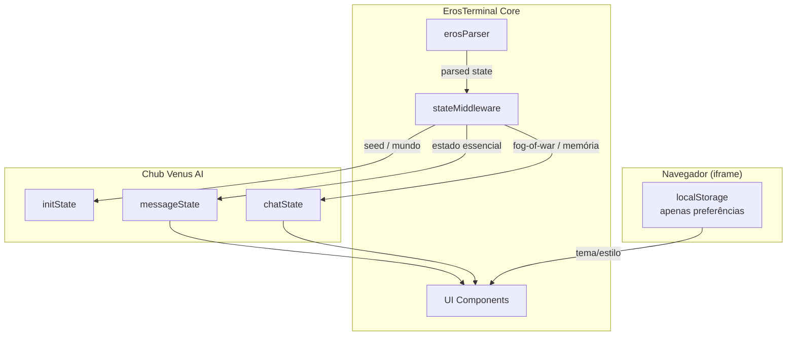

# Mapeamento de Estado — Eros Status Terminal v3.0

> Documento de referência para decisões de persistência entre `messageState`, `chatState` e `localStorage`.

---

## Visão Geral

O Eros Status Terminal (ESS) v3.0 usa a API oficial de Stages do Chub Venus AI. O estado é dividido em três camadas:

| Camada | Escopo | Persistência | Uso no ESS |
|--------|--------|--------------|------------|
| `initState` | Chat inteiro, gerado uma vez | StageBase `load()` | Seed do mundo, NPCs recorrentes, salas iniciais |
| `messageState` | Por mensagem/turno | Retornado em `beforePrompt` / `afterResponse` / `setState` | Estado vivo do personagem, progressões, localização, inventário, etc. |
| `chatState` | Chat inteiro, todas as branches | Retornado em `load` / `beforePrompt` / `afterResponse` | Fog-of-war, mapa revelado, memória de longo prazo, metadados globais |
| `localStorage` | Navegador local apenas | API do navegador dentro do iframe | **Apenas preferências locais** (tema, densidade, estilo de barra) |

---

## 1. `messageState` — Estado por Mensagem

Contém todo o estado essencial que pode variar a cada resposta da IA. Este é o corpo principal do `ErosStatusState`.

### Campos incluídos

| Campo | Descrição | Por quê está em `messageState` |
|-------|-----------|-------------------------------|
| `system` | Dia, hora, clima, tipo de cena | Muda a cada turno |
| `character` | Nome, humor, expressão, pensamentos | Estado emocional do personagem |
| `userCharacter` | Nome/relação do usuário | Pode evoluir |
| `progressions` | Afeto, libido, excitação, etc. | Muda a cada interação |
| `clothingSlots` | Roupas equipadas | Muda conforme narrativa |
| `body` | Expressão corporal, postura, descrição | Muda conforme narrativa |
| `location` | Sala atual, objetos, mini-mapa | Muda conforme movimentação |
| `inventory` | Itens carregados | Muda conforme ações |
| `goals` | Metas atuais | Muda conforme narrativa |
| `npcs` | NPCs presentes no momento | Muda por cena |
| `sexModule` | Status sexual detalhado | Muda durante cenas NSFW |
| `reactionModule` | Reações/emotes | Muda por estímulo |
| `ntrModule` | Gatilhos NTR | Muda quando habilitado |
| `ui_commands` | Comandos sugeridos de UI | Orientam a interface por turno |
| `meta` | IDs de turno, branch, validação | Necessário para branching |
| `img_module` | Anchors e prompts de imagem | Muda por cena |
| `audit` | Problemas de consistência detectados | Pode mudar a cada parse |

### Regras

- Todo campo acima **deve** ser retornado em `afterResponse` quando houver mudanças.
- O StageBase persiste automaticamente o `messageState` por mensagem.
- Nunca confie que esses dados estarão disponíveis em `localStorage`.

---

## 2. `chatState` — Estado Global do Chat

Contém dados que transcendem mensagens individuais e regenerações (branches).

### Campos incluídos

| Campo | Descrição | Por quê está em `chatState` |
|-------|-----------|----------------------------|
| `visitedRooms` | Histórico de salas visitadas | Fog-of-war / memória espacial |
| `revealedRooms` | Salas reveladas no mapa | Deve persistir entre branches |
| `knownMap` | Mapa completo conhecido | Estrutura global do mundo |
| `longTermMemory` | Fatos + resumo narrativo condensado | Memória de longo prazo |
| `turnHistory` | Histórico de turnos e branches | Navegação/auditoria |
| `globalMeta` | Total de turnos, branch atual | Metadados globais |
| `schema_version` | Versão do schema | Migrações futuras |

### Regras

- `chatState` só deve ser retornado quando houver mudanças globais.
- É ideal para fog-of-war: uma sala revelada em uma branch continua revelada em outra.
- A memória de longo prazo é condensada periodicamente e armazenada aqui.

---

## 3. `initState` — Estado Inicial

Gerado uma única vez no início do chat.

### Campos incluídos

| Campo | Descrição |
|-------|-----------|
| `schema_version` | Versão do schema |
| `worldSeed` | Seed do mundo/cenário |
| `initialKnownRooms` | Salas conhecidas desde o início |
| `recurringNPCs` | NPCs fixos do cenário |
| `createdAt` | Timestamp de criação |

### Regras

- Usado para configurar o mundo na primeira carga.
- Não deve conter estado dinâmico do personagem.

---

## 4. `localStorage` — Apenas Preferências Locais

O `localStorage` do navegador dentro do iframe sandbox deve ser usado **apenas** para preferências que não afetam a lógica de negócio e podem ser perdidas sem problema.

### Campos permitidos

| Campo | Descrição |
|-------|-----------|
| `ess:theme` | Tema de interface (`dark`, `cyberpunk`, `midnight`) |
| `ess:barStyle` | Estilo das barras (`bar`, `ascii`, `emoji`) |
| `ess:density` | Densidade de informação (`compact`, `comfortful`) |
| `ess:startMinimized` | Preferência de minimização |
| `ess:activeTab` | Última aba ativa (conveniência local) |

### Campos PROIBIDOS em `localStorage`

| Campo | Motivo |
|-------|--------|
| `openRouterApiKey` | Segurança — a chave não deve persistir localmente |
| `progressions` | Estado crítico do personagem |
| `inventory` | Estado crítico do personagem |
| `location` | Estado crítico do personagem |
| `relationships` | Estado crítico do personagem |
| `sexModule` / `ntrModule` | Estado crítico do roleplay |
| `audit` | Estado deve ser reproduzível por turno |

---

## 5. Diagrama de Fluxo de Dados

---

## 6. Checklist de Conformidade

- [x] `messageState` contém estado essencial do personagem/progressões/localização/inventário/etc.
- [x] `chatState` contém fog-of-war/mapa/salas visitadas/metadados globais/memória de longo prazo.
- [x] `initState` contém seed/mundo inicial e NPCs recorrentes.
- [x] `localStorage` contém apenas preferências locais.
- [x] `openRouterApiKey` nunca é persistida em `localStorage`.
- [x] Schemas versionados (`schema_version`) para migrações futuras.
- [x] `chub_meta.yaml` reflete este mapeamento em `state_schema`.
