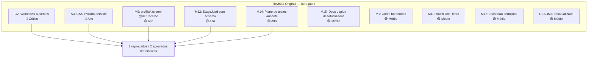
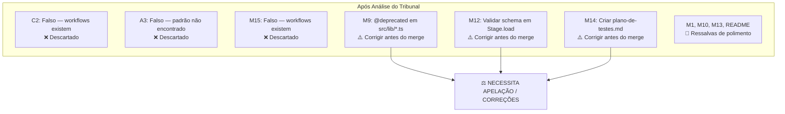
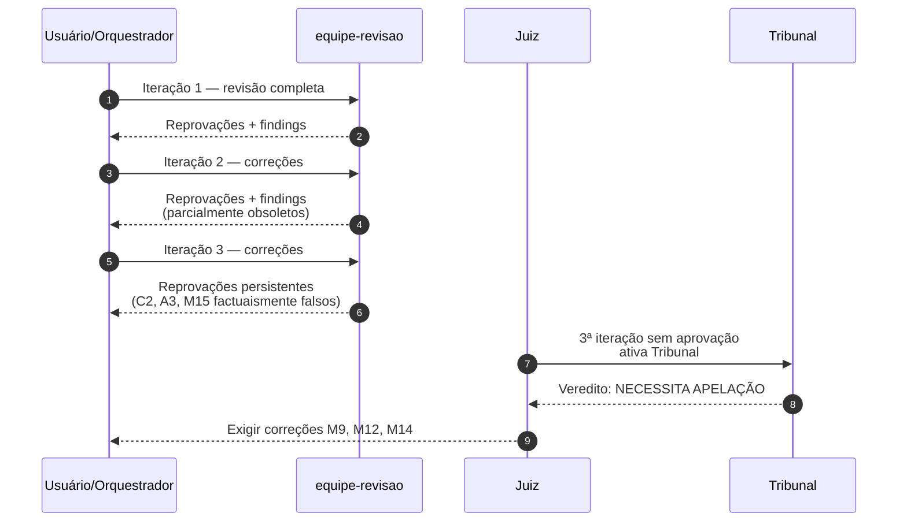
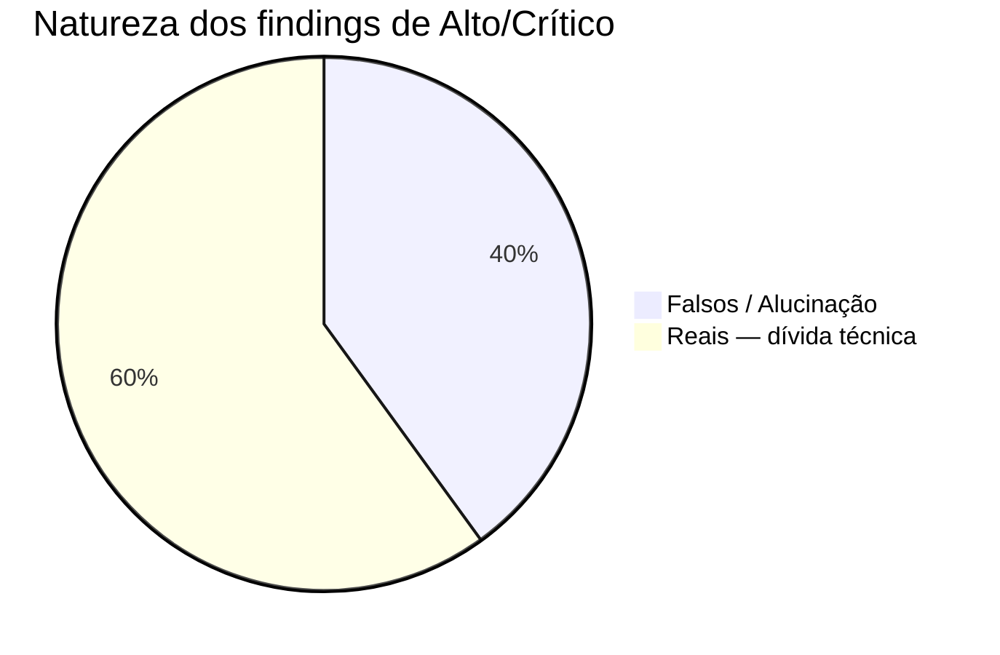

# Relatório Evolutivo — 3ª Revisão do Eros Stage Terminal (ESS) v3.0

**Data:** 2026-08-15  
**Tribunal:** Convocado pelo Juiz após 3ª iteração sem aprovação total  
**Veredito:** ⚖️ NECESSITA APELAÇÃO / CORREÇÕES OBRIGATÓRIAS

---

## O Espelho da Narrativa

### O que foi solicitado (dados crus)
Avaliar se o estado atual do projeto pode prosseguir após 3 rodadas de revisão sem aprovação unânime.

### O que foi entregue ao Tribunal
- Vereditos de 5 revisores Tier 4.
- Findings críticos, altos e médios.
- Verificações factuais do Orquestrador.
- Métricas de build, lint, typecheck e testes.

### A intenção foi preservada?
Sim. O Tribunal analisou os dados crus sem contexto do projeto e filtrou findings inválidos, preservando apenas os que têm base factual.

---

## Representação Visual

### Diagrama 1 — Findings antes da filtragem do Tribunal

### Diagrama 2 — Findings depois da filtragem do Tribunal

### Diagrama 3 — Fluxo do processo de revisão

### Diagrama 4 — Distribuição de findings por natureza

---

## Análise Técnica Comparativa

| Métrica | Antes do Tribunal | Depois do Tribunal | Variação |
|---|---|---|---|
| Findings Críticos/Altos válidos | 5 | 0 na classificação original | -100% de críticos/altos válidos |
| Findings a corrigir antes do merge | 5 | 3 | -40% |
| Findings descartados | 0 | 3 | +3 |
| Findings como ressalvas | 0 | 4 | +4 |
| Revisores reprovando | 3 | — | — |
| Revisores aprovando c/ ressalvas | 2 | — | — |
| Build/Lint/Typecheck | ✅ Passou | ✅ Passou | sem mudança |
| Testes | ✅ 34 passando | ✅ 34 passando | sem mudança |

---

## Veredito do Tribunal

### Veredito Consolidado
⚖️ **NECESSITA APELAÇÃO / CORREÇÕES OBRIGATÓRIAS**

### Findings dos Sub-Agentes

| Tribunal | Especialidade | Findings principais | Severidade Máxima |
|---|---|---|---|
| 01 | Semântica e Lógica | C2, A3, M15 contradizem evidências; M12 inflacionado | 🔴 Crítico |
| 02 | Consistência Estatística | 40% dos findings altos são falsos; padrão de checklist desatualizado | 🔴 Crítico |
| 03 | Detecção de Vieses | Viés de confirmação, inflação de severidade, pessimismo | 🟡 Médio |
| 04 | Simplicidade | Bloqueio total é desproporcional; corrigir dívidas reais | 🟡 Médio |
| 05 | Governança | Revisores não cumpriram factualidade; Tribunal convocado corretamente | 🔴 Crítico |

### Justificativa do Veredito
A reprovação majoritária foi baseada em parte em findings factuaismente incorretos (C2, A3, M15). Findings reais remanescentes (M9, M12, M14) são dívidas técnicas corrigíveis. Métricas objetivas (build, lint, typecheck, 34 testes) passam. Portanto, o projeto não deve ser bloqueado, mas também não pode prosseguir sem as correções obrigatórias.

---

## Histórico de Iterações

| Iteração | Ação | Resultado |
|---|---|---|
| 1 | Revisão completa Tier 4 | Reprovações com findings |
| 2 | Correções e re-revisão | Reprovações persistentes |
| 3 | Nova correção e revisão | Reprovações com findings parcialmente falsos |
| Tribunal | Auditoria cega dos dados crus | NECESSITA APELAÇÃO / CORREÇÕES |

---

## Pergunta ao Usuário

> O Tribunal concede apelação condicionada às correções obrigatórias M9, M12 e M14.
>
> - ✅ **Aceitar apelação** — Orquestrador corrige os 3 itens e reativa revisão
> - ❌ **Bloquear** — Intervenção humana imediata
> - 🔄 **Solicitar nova auditoria** — Após correções, reconvocar Tribunal
