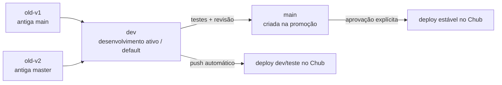

# Estratégia de Branches — Eros Status Terminal

Este repositório segue um modelo de branches baseado em **preservação histórica** (`old-v1` / `old-v2`), **desenvolvimento ativo** (`dev`) e **produção** (`main`, recriada apenas na promoção). Remoto: `https://github.com/Travelmond/Eros-Status-Stage` (usuário `Travelmond`).

## Branches

### `old-v1` (antiga `main`)

- **Conteúdo:** snapshot do código legado que antes vivia em `main`.
- **Origem:** renomeada de `main` no remoto para preservar o histórico.
- **Uso:** preservação histórica. Não recebe novos commits.
- **Deploy:** nenhum. Branch apenas para referência.

### `old-v2` (antiga `master`)

- **Conteúdo:** snapshot do código legado que antes vivia em `master` (1 commit acima de `main`).
- **Origem:** renomeada de `master` no remoto para preservar o histórico.
- **Uso:** preservação histórica. Não recebe novos commits.
- **Deploy:** nenhum. Branch apenas para referência.

### `dev`

- **Conteúdo:** código funcional atual (ESS v3.0).
- **Uso:** branch de trabalho padrão e **branch default no GitHub**.
- **Deploy:** todo push em `dev` dispara o workflow `.github/workflows/deploy-dev.yml` e publica no **stage de teste** do Chub, usando o ID configurado em `secrets.CHUB_EXTENSION_ID_DEV`.

### `dev-backup`

- **Conteúdo:** snapshot de `dev` no estado anterior à sincronização forçada (commit `692c571`).
- **Origem:** criada a partir de `dev` via `git push origin origin/dev:refs/heads/dev-backup` antes do force-push.
- **Uso:** preservação / rollback. Não recebe novos commits.
- **Deploy:** nenhum. Branch apenas para referência e rollback.

### `main`

- **Conteúdo:** versão estável e validada.
- **Uso:** reflete o código aprovado para produção.
- **Criação:** uma nova `main` será criada **apenas no momento da promoção**, sob solicitação explícita do usuário.
- **Deploy:** todo push em `main` dispara o workflow `.github/workflows/deploy.yml` e publica a versão estável no Chub.
- **Regra:** `main` só é tocada mediante solicitação explícita do usuário. Nunca faça push direto.

## Fluxo de promoção



1. Renomeie `main` → `old-v1` e `master` → `old-v2` no remoto, preservando o histórico.
2. Defina `dev` como branch default no GitHub.
3. Desenvolva e teste em `dev`.
4. Quando `dev` estiver estável, crie `main` a partir de `dev` (promoção), somente sob solicitação explícita do usuário.
5. Após revisão e aprovação explícita, publique a versão estável.
6. O workflow `deploy.yml` publicará a versão estável no Chub.

## Secrets obrigatórios

Para que os workflows de deploy funcionem, configure os seguintes secrets em **Settings → Secrets and variables → Actions**:

| Secret | Escopo | Descrição |
|---|---|---|
| `CHUB_AUTH_TOKEN` | Repositório | Token de autenticação da API do Chub Venus AI. Usado tanto por `deploy-dev.yml` quanto por `deploy.yml`. |
| `CHUB_EXTENSION_ID_DEV` | Repositório | ID da extensão/Stage de **desenvolvimento/testes** no Chub. Usado apenas por `deploy-dev.yml`. Deve ser diferente do ID de produção (`eros-status-stage-b47cccbfa255`). |

### Por que dois secrets?

- `CHUB_AUTH_TOKEN` é o mesmo para ambos os ambientes (o token identifica a conta/autorização).
- `CHUB_EXTENSION_ID_DEV` é separado para garantir que o deploy de teste nunca sobrescreva o Stage de produção. Isso corrige o finding **C2** da revisão.

### Validação no workflow

Ambos os workflows falham de forma clara caso os secrets estejam ausentes:

```bash
if [ -z "$CHUB_AUTH_TOKEN" ]; then
  echo "::error::CHUB_AUTH_TOKEN secret is not configured."
  exit 1
fi

if [ -z "${{ env.CHUB_EXTENSION_ID }}" ]; then
  echo "::error::CHUB_EXTENSION_ID_DEV secret is not configured."
  exit 1
fi
```

## Regras duras

- **Nunca commite secrets, `.env` ou API keys.**
- **`CHUB_AUTH_TOKEN` e `CHUB_EXTENSION_ID_DEV` devem ser configurados apenas como GitHub Secrets.**
- **`main` só é tocada mediante solicitação explícita do usuário.**
- **`old-v1` e `old-v2` são imutáveis** após a renomeação.
- **`dev-backup` é imutável** após a criação (snapshot de rollback).
- **Sempre use `CHUB_EXTENSION_ID_DEV` diferente do ID de produção** para evitar sobrescrita acidental.

## Branches locais vs. remotas

| Branch   | Remoto          | Local           | Conteúdo esperado                          | Deploy |
|----------|-----------------|-----------------|--------------------------------------------|--------|
| `old-v1` | `origin/old-v1` | `old-v1`        | Código antigo (antiga `main`)              | Nenhum |
| `old-v2` | `origin/old-v2` | `old-v2`        | Código antigo (antiga `master`)            | Nenhum |
| `dev`    | `origin/dev`    | `dev`           | Código novo em desenvolvimento (default)    | Stage de teste |
| `dev-backup` | `origin/dev-backup` | `dev-backup` | Snapshot de `dev` (`692c571`) para rollback | Nenhum |
| `main`   | `origin/main`   | `main`          | Estável (criada na promoção)               | Stage de produção |
