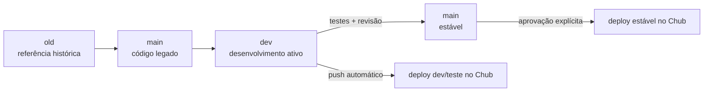

# Estratégia de Branches — Eros Status Terminal

Este repositório segue um modelo de branches de **três vias** (`old` / `dev` / `main`) para preservar o histórico, isolar desenvolvimento e controlar a qualidade do deploy no Chub Venus AI.

## Branches

### `old`

- **Conteúdo:** snapshot do código antigo/desatualizado do repositório original.
- **Origem:** `origin/main` (ou branch padrão do repositório remoto) no momento em que o projeto foi reescrito.
- **Uso:** preservação histórica. Não recebe novos commits.
- **Deploy:** nenhum. Branch apenas para referência.

### `dev`

- **Conteúdo:** código funcional atual (ESS v3.0).
- **Origem:** criada a partir de `main` após a criação de `old`.
- **Uso:** branch de trabalho padrão. Todos os novos recursos e correções são desenvolvidos aqui.
- **Deploy:** todo push em `dev` dispara o workflow `.github/workflows/deploy-dev.yml` e publica no **stage de teste** do Chub, usando o ID configurado em `secrets.CHUB_EXTENSION_ID_DEV`.

### `main`

- **Conteúdo:** versão estável e validada.
- **Uso:** reflete o código aprovado para produção.
- **Deploy:** todo push em `main` dispara o workflow `.github/workflows/deploy.yml` e publica a versão estável no Chub.
- **Regra:** nunca faça push direto em `main`. A atualização só ocorre mediante solicitação explícita do usuário.

## Fluxo de promoção



1. Crie `old` a partir da `main` legado antes de qualquer reescrita.
2. Desenvolva e teste em `dev`.
3. Quando `dev` estiver estável, abra um pull request para `main`.
4. Após revisão e aprovação explícita, faça merge do PR.
5. O workflow `deploy.yml` publicará a versão estável.

## Secrets obrigatórios

Para que os workflows de deploy funcionem, configure os seguintes secrets em **Settings → Secrets and variables → Actions**:

| Secret | Escopo | Descrição |
|---|---|---|
| `CHUB_AUTH_TOKEN` | Repositório | Token de autenticação da API do Chub Venus AI. Usado tanto por `deploy-dev.yml` quanto por `deploy.yml`. |
| `CHUB_EXTENSION_ID_DEV` | Repositório | ID da extensão/Stage de **desenvolvimento/testes** no Chub. Usado apenas por `deploy-dev.yml`. Deve ser diferente do ID de produção (`eros-status-stage-b47cccbfa255`). |

### Por que dois secrets?

- `CHUB_AUTH_TOKEN` é o mesmo para ambos os ambientes (o token identifica a conta/autorização).
- `CHUB_EXTENSION_ID_DEV` é separado para garantir que o deploy de teste nunca sobrescreva o Stage de produção. Isso corrige o finding **C2** da revisão.

### Validação no workflow

Ambos os workflows falham de forma clara caso os secrets estejam ausentes:

```bash
if [ -z "$CHUB_AUTH_TOKEN" ]; then
  echo "::error::CHUB_AUTH_TOKEN secret is not configured."
  exit 1
fi

if [ -z "${{ env.CHUB_EXTENSION_ID }}" ]; then
  echo "::error::CHUB_EXTENSION_ID_DEV secret is not configured."
  exit 1
fi
```

## Regras duras

- **Nunca commite secrets, `.env` ou API keys.**
- **`CHUB_AUTH_TOKEN` e `CHUB_EXTENSION_ID_DEV` devem ser configurados apenas como GitHub Secrets.**
- **Nunca faça push direto em `main`.**
- **`old` é imutável** após a criação inicial.
- **Sempre use `CHUB_EXTENSION_ID_DEV` diferente do ID de produção** para evitar sobrescrita acidental.

## Branches locais vs. remotas

| Branch | Remoto          | Local           | Conteúdo esperado                    | Deploy |
|--------|-----------------|-----------------|--------------------------------------|--------|
| `old`  | `origin/old`    | `old`           | Código antigo do repositório original| Nenhum |
| `dev`  | `origin/dev`    | `dev`           | Código novo em desenvolvimento       | Stage de teste |
| `main` | `origin/main`   | `main`          | Estável (promovido de `dev`)         | Stage de produção |
