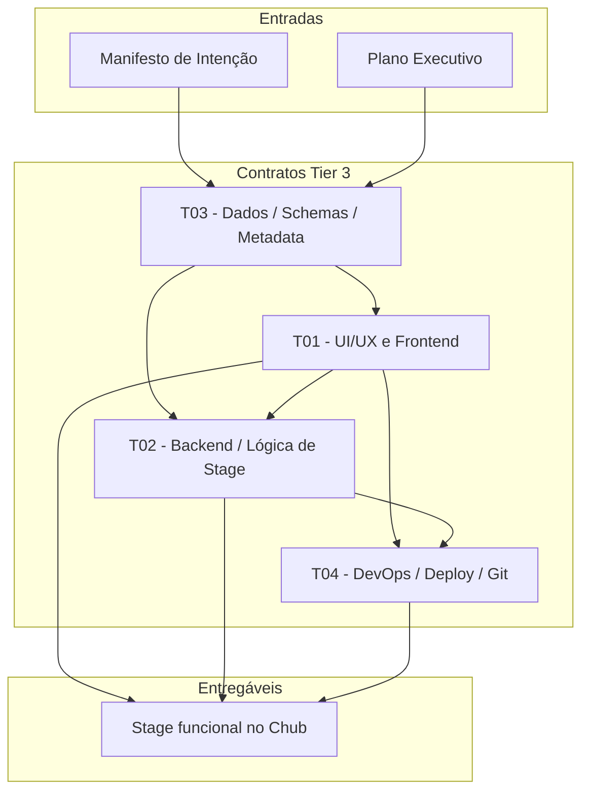

# 🔗 Diagrama de Dependências dos Contratos

Este documento mostra a ordem de execução e as dependências entre os contratos de Tier 3 gerados para o Eros Status Terminal (ESS) v3.0.

## Ordem de Execução

## Legenda

| Símbolo | Significado |
|---|---|
| `A --> B` | Contrato A deve ser concluído antes de B iniciar ou B depende diretamente de A. |
| `M --> T03` | O manifesto e o plano executivo alimentam a definição dos schemas. |

## Justificativa

1. **T03 (Dados / Schemas / Metadata)** vem primeiro porque define os contratos de dados (`ErosStatusState`, `messageState`, `chatState`, `ConfigType`) que todos os outros contratos consomem. Sem os schemas, frontend e backend não têm interface comum.

2. **T01 (UI/UX e Frontend)** e **T02 (Backend / Lógica de Stage)** podem avançar em paralelo após T03, mas T02 depende parcialmente de T01 porque o método `render()` do `StageBase` deve instanciar o componente `ErosTerminal`.

3. **T04 (DevOps / Deploy / Git)** é o último porque depende da existência de build funcional (T01 + T02) e do `chub_meta.yaml` válido (T03).

4. O deploy final (`ST`) só ocorre quando T01, T02 e T04 estão validados.
